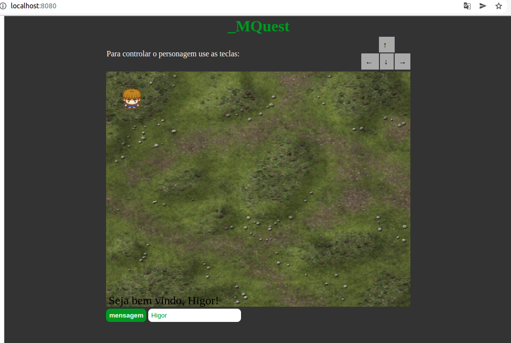

# _MQuest  :crossed_swords:

## O jogo
É um simples jogo de RPG, ainda nem sei qual vai ser a história do personagem, estou construindo tudo junto, espero organizar esse projeto e evitar muito código poluido ;)  

## Motivaçao
* Quero ensinar meu filho a se interessar por tecnologia futuramente, ensinando ele a fazer jogos, mas como eu não sei fazer, preciso aprender
* É um baita desafio fazer um jogo sem framework, sem lib, sem engine, é legal pra aprender sobre o DOM, eventListeners e sobre renderização com canvas

##  Tecnologias Usadas
* HTML
* CSS
* Javascript

## Como executar o jogo
Com o node e o npm previamente instalados rode um npm install -g http-server, 
abra o projeto e na pasta do projeto execute o comando http-server, esse projeto não possui dependencias e nem é preciso fazer um build então é só subir e jogar (quando estiver pronto, por enquanto não tem muito o que fazer) abra o seu navegador e acess http://localhost:8080

## Status
Em desenvolvimento

## Bugs? :bug:
Sim por toda parte :joy: